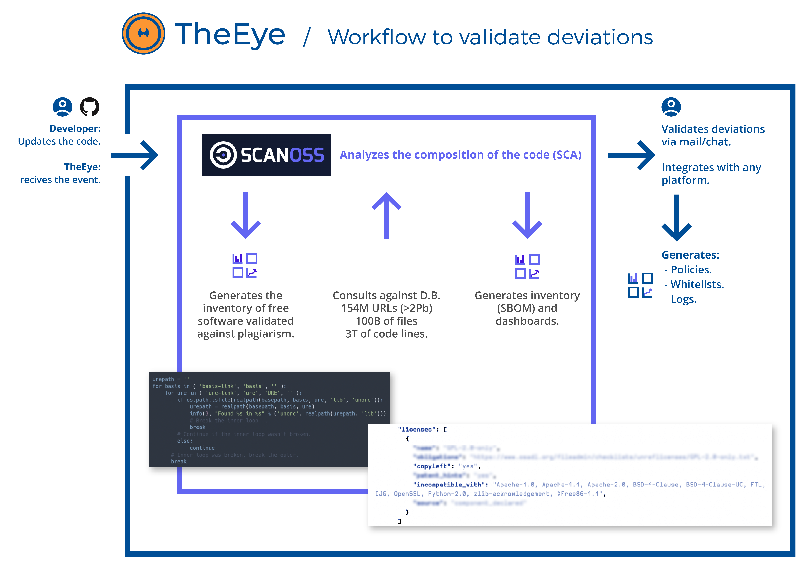

 # How to integrate SCANOSS to your Continuous Integration Pipeline from github by using TheEye as the choreographer on a single machine.



If you want, check this 2 mins video:

[](https://youtu.be/GxjtUZ6cnKI)

## Quickly install TheEye in your local environment.

This tutorial was written using Ubuntu 22.04. For achieving this task you need to clone our repository and run quickstart.sh

Please run:
```bash
git clone https://github.com/theeye-io-team/theeye-of-sauron.git

./quickstart.sh
```

For more information, please refer to our [Documentation](https://documentation.theeye.io/#/)

## Import and configure your workflow.

1. Once it is finished, please login at http://localhost:6080 and complete it with the credentials provided by the installer

    > **Warning**
    > The login credentials should be changed ASAP if you're planning on exposing TheEye to the internet

    

2. Download the file [`SCANOSSWorkflow.json`](./SCANOSSWorkflow.json) provided in this repo and import it into Theeye
   1. Click on the **+** menu and select *Workflow*
   2. Choose *Import* and select the file `SCANOSSWorkflow.json` 
   
    |||
    |----|----|

3. Set your Github repository. 
   1.  Edit the task called *'Pull from GITHUB'*. You can edit the task by clicking on it and clicking 'Edit task' in the context menu
   2.  Scroll down to *Task Arguments* and edit them as needed:
       * (1) The name of the repo
       * (2) The installation source directory
       * (3) The GitHub username of whom the repo belongs to
       * (4) The GitHub user's access token, optional if the repo is public

    > **Note**
    > This workflow works with private and public repositories, but for this tutorial we are working on a public repository.

    |||
    |----|----|

    <!-- TODO: Cambiar imagen 6, no es muy clara -->

4. Now set the deployment approvers and the users who will receive the notification.
   You should also configure a Webhook to continue the deployment pipeline, however in this tutorial we will skip this step.

    

## After setup

Once set up, we encourage you to manually execute the workflow to see what happens.
    
* Within the *Workflows* tab inside the dashboard, press the :arrow_forward: icon in the workflow to execute it

    

* We can see that it finds a deviation and asks for its approval, and we are done!

    > **Note**
    > This alert will be shown to the approvers set up on step 4 of the configuration guide

    

## Integrate the workflow into the pipeline

We can setup the workflow to start with an incoming webhook that we can configure from github
  
1. Navigate to the *Webhook* tab in TheEye
    
2. Create a new webhook and take a note of it's link
    
<!-- TODO: Mostrar cómo agarrar el link -->
<!-- Se puede remplazar la foto 11 que es bastante redundante -->
3. Edit the workflow, click on settings and choose your new webhook in the *Triggered by* input
    

And that's it! If you have any questions write to support@theeye.io or create a ticket in this repository

Please leave us a star at https://github.com/theeye-io-team/theeye-of-sauron.git

Thanks!


