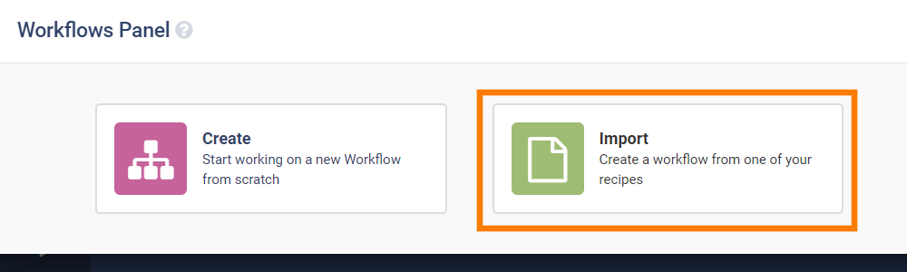
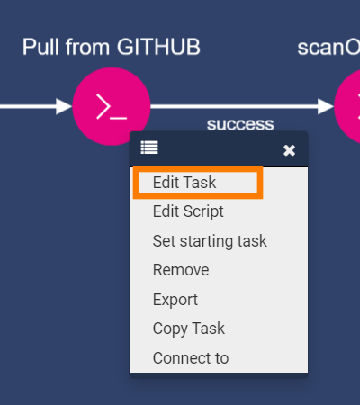
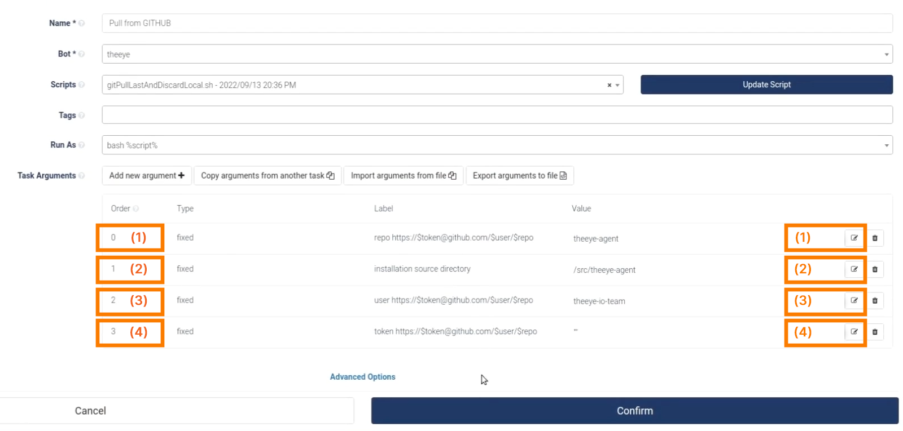
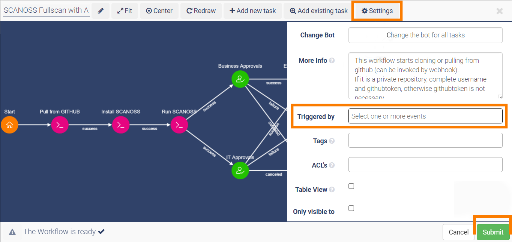

 # How to integrate SCANOSS to your Continuous Integration Pipeline from github by using TheEye as the choreographer on a single machine.
 
 

If you want, check this 2 mins video:
[](https://youtu.be/GxjtUZ6cnKI)

## Lets Begin
## First step is to install theeye. 
This tutorial was writing using Ubuntu 22.04. For achieving this task you need to clone our repository and run quickstart.sh

Please run:
 ```
git clone https://github.com/theeye-io-team/theeye-of-sauron.git
 ./quickstart.sh
```
## Second step is to import and configure your workflow.
<table cellspacing="0" cellpadding="0">
   <tr>
    <td> Once is finished, please login at http://localhost:6080
and complete with the credentials provided by the installer (change this if your are planing to expose to the internet).</td>
    <td> </td>
   </tr> 
   <tr>
    <td> download SCANOSSWorkflow.json provided in this repo and import it into Theeye
    </td>
    <td> 
         
         
    </td>
   </tr> 
   <tr>
   <td>
       Set your Github repository, which works with private and public repositories. But for this tutorial we are working on a public repository.
   </td>
   <td>
         
         
   </td>
   </tr> 
   <tr>
   <td>
     Now set the deployment approvers, in this demo both are the same. 
     The ones who receive the notification, in this demo, again, both are the same.
     And you should configure a Webhook to continue the deployment. However In this tutorial We are not setting this.
   </td>
   <td>
         
   </td>
   </tr> 
   <tr>
   <td>
     Once set up, we encourage you to manually play the workflow to see what happens.
   </td>
   <td>
         
   </td>
   </tr> 
   <tr>
   <td>
         We can see that it finds a deviation and asks for its approval, and we are done.
   </td>
   <td>
         
   </td>
   </tr> 
   <tr>
   <td>
         We can start this workflow by configuring an outgoing webhook from github.
   </td>
   <td>
         
         
         

   </td>
   </tr> 
</table>

And that 's it. If you have any questions write to support@theeye.io or create a ticket in this repository

Please leave us a star at https://github.com/theeye-io-team/theeye-of-sauron.git

Thanks!


